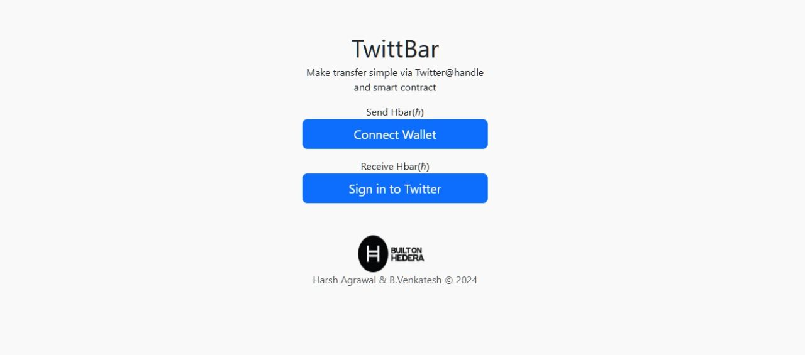
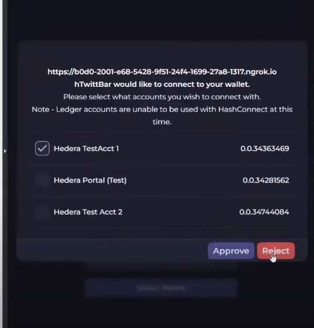
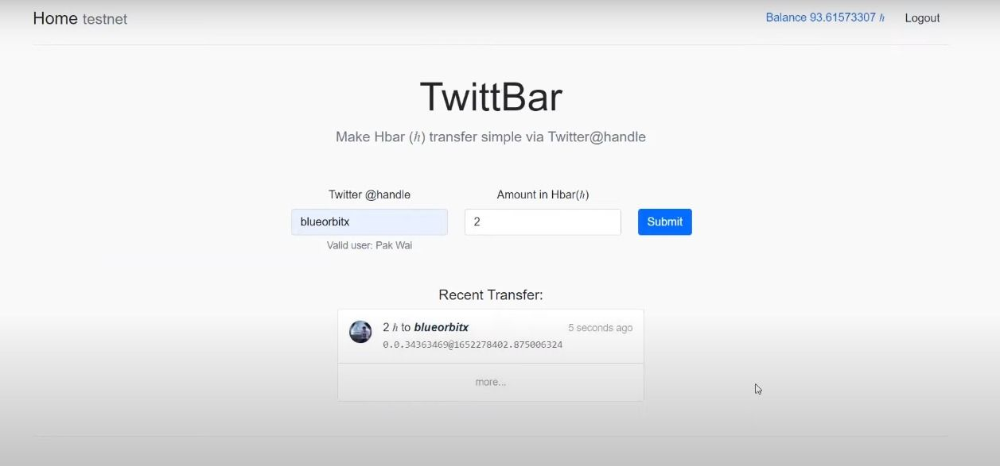
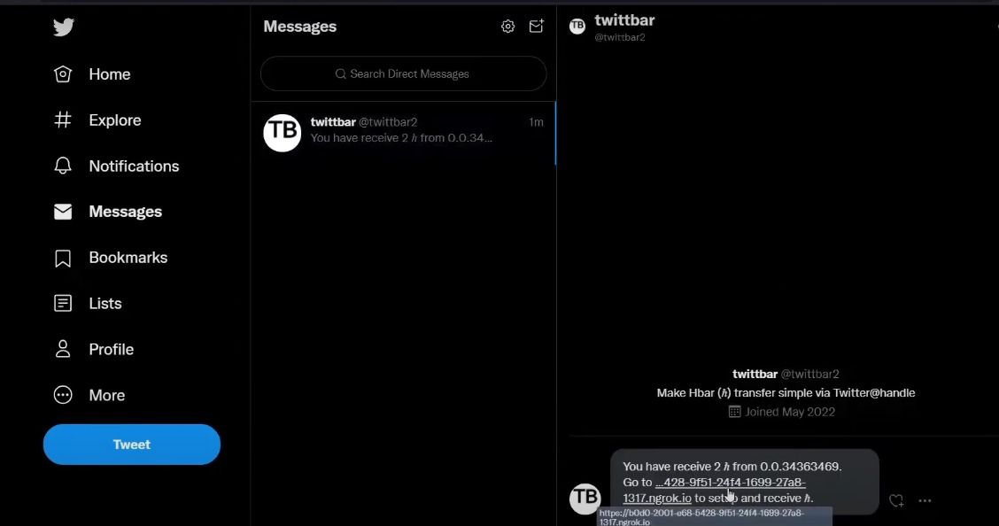
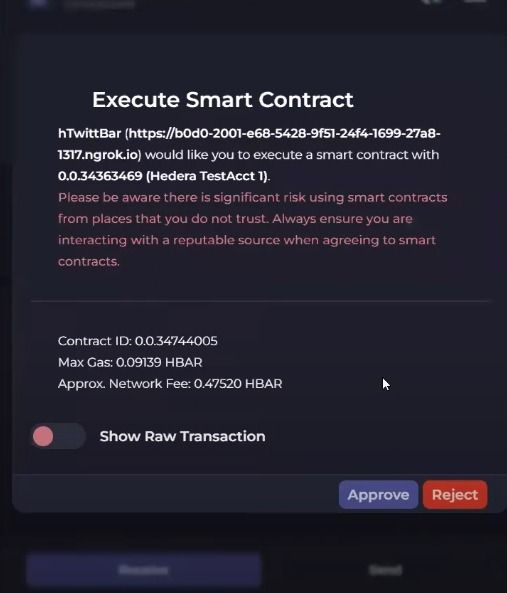

# Twittbar

Decentralized finance (DeFi) is a system that uses blockchain and cryptocurrency to manage financial transactions without the involvement of intermediaries like banks. DeFi aims to democratize finance by replacing centralized institutions with peer-to-peer relationships

`Video Demo Link` : https://stream.mux.com/2s00UMQVssXjUZZKW02MagCcO5Coxqpz1eVJBVoB61aFU/high.mp4

The thought of using a smart contract and linking the Twitter **handle(username)** to a **wallet address** helps to make the transfer easy. At the same time, we also get the benefit of transferring funds using a recognizable name.

## ETHGlobal Hackathon Winner

`Showcase Link Here` : https://ethglobal.com/showcase/money-3-0-twittbar-kmzs1

## ScreenShot

## Pre-requisite

- Create a developer account with [Hedera Portal](https://portal.hedera.com)
  + Create a Hedera account on Testnet.
- Create a developer account with [Twitter Portal](https://developer.twitter.com/en/portal/dashboard)
  + Create a new Project. Enable OAuth1.0, OAuth2.0, Automated App or Bot, and Direct Message.
- Insert the callback url: `http://localhost:3000/api/auth/callback/twitter`. Update the localhost accordingly on prod or ngrok.
- Create an account with [MongoDB](https://account.mongodb.com/account/login).
  + Create a new database and collection.

## Getting started
- install [Hashpack](https://www.hashpack.app) browser extension
- install [Ngrok](https://ngrok.com)
- `cd contract` & `yarn install`
- rename `.env.sample` to `.env` and fill in the variable from the pre-requisite.
- `yarn build`
  + to build (rollup) the stratojs and `.sol` into a `dist/*.js` library for web-browser usage
- copy `dist/hedera-strato.hashpack.js` to `nextapp/public/hedera-strato.hashpack-esm.js`.
- `cd nextapp` & `yarn install`
- rename `.env.local.sample` to `.env.local` and fill in the variable
  + not that twitter DM has limited quota per day. `DISABLE_DM` if not necessary for development.
- `yarn dev`
- start `ngrok http 3000`
  + This is needed due to "HashPack" only validate from `https://`.

## Deploy to Vercel

`git subtree push --prefix nextapp vercel master`

## Philosophy
- `contract` directory
  + mainly to facilitating to experiment and develop smart contract
  + `experiment-hashgraph.js` is redundant (really for experiment)
  + `experiment-strato.js` is test strato. Use this script to deploy to `testnet` or `mainnet`
  + Why the Rollup? Due to the maturity of the library. We use strato as the main library for the web-app. However, we need to compile before it can be use on the browser.
- `nextapp` directory
  + on the main page, we separate them into 2 core logic. `\wallet` page and `\twitter` page.
  + `\wallet` page need to connect via Hashpack wallet before proceed.
  + on the page, user get to transfer via Twitter or see their transfer list.
  + `\twitter` page need to connect via Sign In with Twitter.
  + on the page, it guide user to setup the wallet and update their wallet to the oracle smart contract.
  + the user also get to see the list of fund that is transferred to them via this service.
  + the used of MongoDB is to store the transaction for query. However, the source of truth is will be on the chain itself.

# How we built it
We use Hedera smart contract. More specifically, we use the Strato library to communicate with the smart contract. We use Twitter API which to validate the user and send a notification to them when there is a fund transferred to their name.

# Improvement
- This maybe costly (gas fee) if not optimize to query from MongoDB.
  + Certain API depends on reading the value from Smart Contract.
  + Can consider check for changes before update smart contract to reduce cost.
- Additional work flow for user to directly update Hedera Account within the DM.
- Expanding similar use case to other social media platform.

# Reference link
- [Get started with smart contract](https://hedera.com/blog/how-to-deploy-smart-contracts-on-hedera-part-1-a-simple-getter-and-setter-contract)
- [Solidity Dev](https://remix.ethereum.org)
- [First contract Eg](https://docs.hedera.com/guides/getting-started/try-examples/deploy-your-first-smart-contract)
- [Oracle reference](https://github.com/provable-things/ethereum-api/blob/master/oraclizeAPI_0.5.sol)
- [Using Oracle Example](https://fravoll.github.io/solidity-patterns/oracle.html)
- [Next JS doc](https://nextjs.org/docs)
- [Hashconnect on Next](https://www.youtube.com/watch?v=5klHbH0LEdU)
- [Stratos JS](https://hsj-docs.buidlerlabs.com)
- [Stratos JS Sample](https://github.com/buidler-labs/hsj-example/blob/main/.env.sample)
- [Stratos JS Rollup Demo](https://github.com/buidler-labs/hsj-rollup-demo)
- [PR to fix fail example](https://github.com/buidler-labs/hsj-rollup-demo/pull/1)
- [Next Auth](https://spacejelly.dev/posts/how-to-authenticate-next-js-apps-with-twitter-nextauth-js/)
- [Next Auth Upgrade](https://next-auth.js.org/getting-started/upgrade-v4#next-authreact)
- [Next Auth Twitter Provider](https://next-auth.js.org/providers/twitter)
- [Next Auth Example](https://spacejelly.dev/posts/how-to-authenticate-next-js-apps-with-twitter-nextauth-js/)
- [Next Auth Example](https://spacejelly.dev/posts/how-to-make-twitter-api-requests-with-nextauth-js-session-tokens/)
- [Get started with smart contract](https://hedera.com/blog/how-to-deploy-smart-contracts-on-hedera-part-1-a-simple-getter-and-setter-contract)

## Project Maintainers👷:

<table>
<tr>
<td><h4 style="color:red;">Harsh Agrawal</h4></td> 
  
  <td><h4 style="color:red;">Venky Kumar</h4></td>
</tr>
</table>
